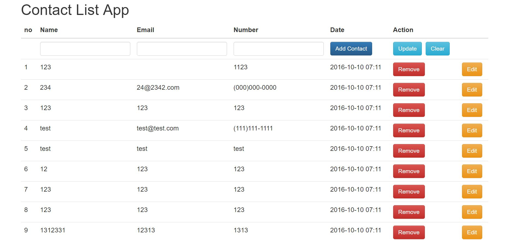

# listapp with MEAN Stack

버전 0.1 입니다. 매일 업데이트 됩니다.

개발환경

<ul>
	<li>Node.JS</li>
	<li>express</li>
	<li>mongoose</li>
	<li>angular.JS</li>
</ul>

현재 업데이트 된 기능 : 

<ul>
	<li>날짜 추가.</li>
	<li>번호 추가.</li>
</ul>

추가 할 기능 : 

<ul>
	<li>검색 기능</li>
	<li>ul 개선</li>
</ul>

<h2>프리뷰</h2>

